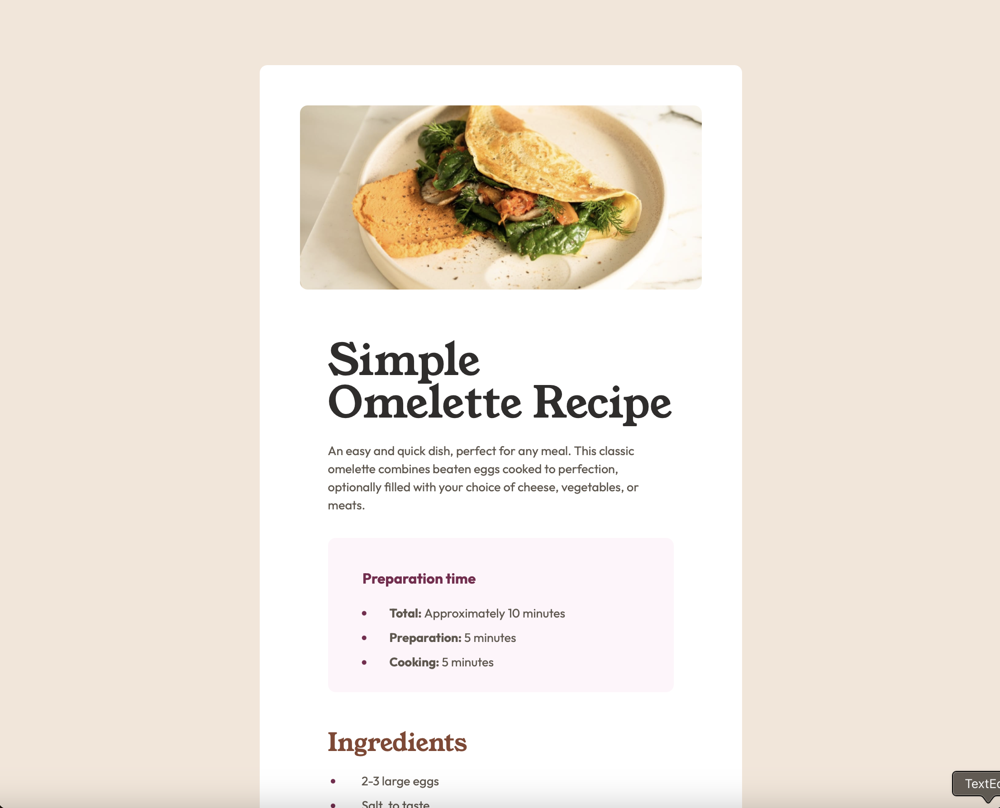

# Frontend Mentor - Recipe page solution

This is a solution to the [Recipe page challenge on Frontend Mentor](https://www.frontendmentor.io/challenges/recipe-page-KiTsR8QQKm). Frontend Mentor challenges help you improve your coding skills by building realistic projects. 

## Table of contents

- [Overview](#overview)
  - [The challenge](#the-challenge)
  - [Screenshot](#screenshot)
  - [Links](#links)
- [My process](#my-process)
  - [Built with](#built-with)
  - [What I learned](#what-i-learned)
  - [Continued development](#continued-development)
  - [Useful resources](#useful-resources)
- [Author](#author)
- [Acknowledgments](#acknowledgments)

## Overview

### Screenshot




Add a screenshot of your solution. The easiest way to do this is to use Firefox to view your project, right-click the page and select "Take a Screenshot". You can choose either a full-height screenshot or a cropped one based on how long the page is. If it's very long, it might be best to crop it.

Alternatively, you can use a tool like [FireShot](https://getfireshot.com/) to take the screenshot. FireShot has a free option, so you don't need to purchase it. 

Then crop/optimize/edit your image however you like, add it to your project, and update the file path in the image above.

**Note: Delete this note and the paragraphs above when you add your screenshot. If you prefer not to add a screenshot, feel free to remove this entire section.**

### Links

- Solution URL: [Add solution URL here](https://your-solution-url.com)
-[Live Site] URL:(https://twnmom313.github.io/fm-recipe-page-main/)

## My process

### Built with

- Semantic HTML5 markup
- CSS custom properties
- Mobile-first workflow

**Note: These are just examples. Delete this note and replace the list above with your own choices**

### What I learned

learned how to use and input variables. 


```
/* Variables */

:root {
  --white: hsl(0, 0%, 100%);
  --stone-100: hsl(30, 54%, 90%);
  --stone-150: hsl(30, 18%, 87%);
  --stone-600: hsl(30, 10%, 34%);
  --stone-900: hsl(24, 5%, 18%);
  --brown-800: hsl(14, 45%, 36%);
  --rose-800: hsl(332, 51%, 32%);
  --rose-50: hsl(330, 100%, 98%);
  }
```

### Continued development

I am still warming up to coding and using CSS. So i will continue to get my feet wet with little projects like this.

### Useful resources

- [Resource 1]Styling an hr: https://www.w3schools.com/howto/howto_css_style_hr.asp - This helped us with CSS.

## Author

- Website - [Bonnie Soto]
- Frontend Mentor - [@TwnMom313](https://www.frontendmentor.io/profile/TwnMom313)

## Acknowledgments

Thank you to Prof. Kenyada McLeod for beeing patient enough with me and helping to work though this project!

