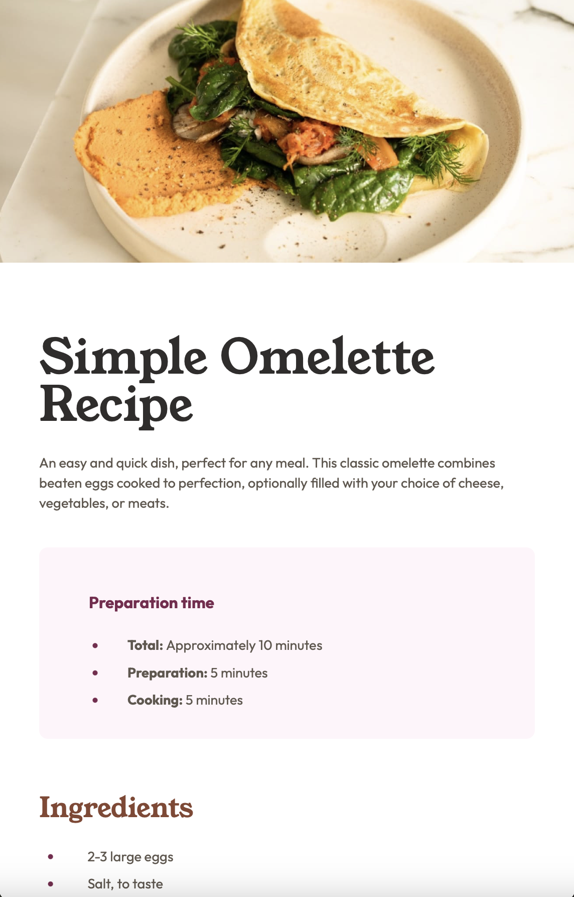
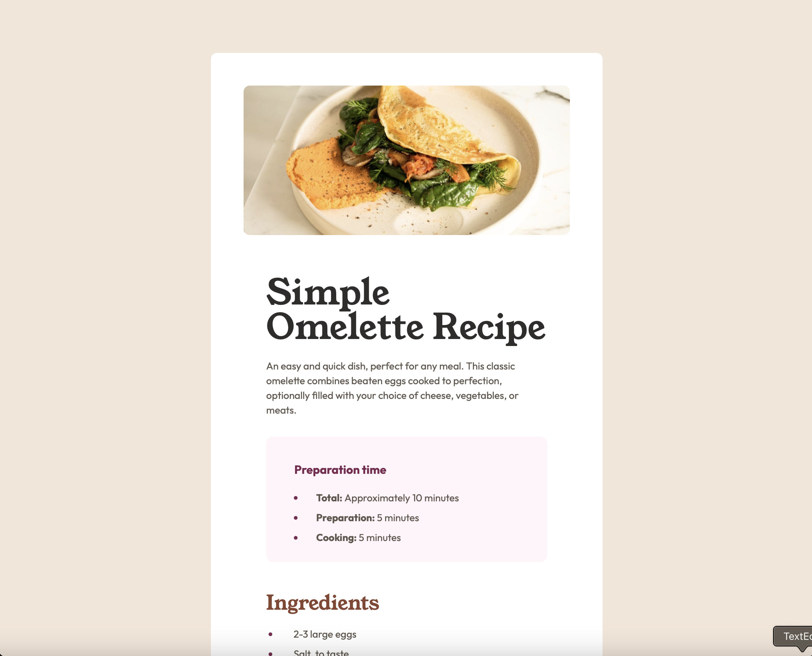

# Frontend Mentor - Recipe page solution

This is a solution to the [Recipe page challenge on Frontend Mentor](https://www.frontendmentor.io/challenges/recipe-page-KiTsR8QQKm). Frontend Mentor challenges help you improve your coding skills by building realistic projects. 

## Table of contents

- [Overview](#overview)
  - [The challenge](#the-challenge)
  - [Screenshot](#screenshot)
  - [Links](#links)
- [My process](#my-process)
  - [Built with](#built-with)
  - [What I learned](#what-i-learned)
  - [Continued development](#continued-development)
  - [Useful resources](#useful-resources)
- [Author](#author)
- [Acknowledgments](#acknowledgments)

## Overview

### Screenshot




### Links

- [Solution URL]([https://your-solution-url.com](https://www.frontendmentor.io/solutions/responsive-layout-mobile-1st-css-variables-html5-css3-kpoKZ5F8SL
)
- [Live Site URL](https://twnmom313.github.io/fm-recipe-page-main/)

## My process

### Built with

- Semantic HTML5 markup
- CSS custom variables
- Mobile-first workflow

### What I learned

learned how to use and input variables. 


```
/* Variables */

:root {
  --white: hsl(0, 0%, 100%);
  --stone-100: hsl(30, 54%, 90%);
  --stone-150: hsl(30, 18%, 87%);
  --stone-600: hsl(30, 10%, 34%);
  --stone-900: hsl(24, 5%, 18%);
  --brown-800: hsl(14, 45%, 36%);
  --rose-800: hsl(332, 51%, 32%);
  --rose-50: hsl(330, 100%, 98%);
  }
```

### Continued development

I am still warming up to coding and using CSS. So i will continue to get my feet wet with little projects like this.

### Useful resources

- [Styling an hr](https://www.w3schools.com/howto/howto_css_style_hr.asp)

## Author

- Website - [Bonnie Soto]
- Frontend Mentor - [@TwnMom313](https://www.frontendmentor.io/profile/TwnMom313)

## Acknowledgments

Thank you to Prof. Kenyada McLeod for beeing patient enough with me and helping to work though this project!

